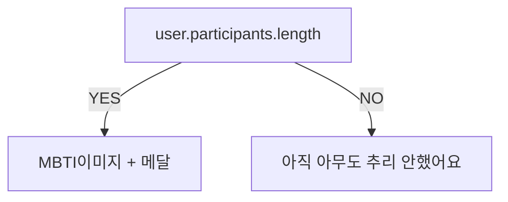
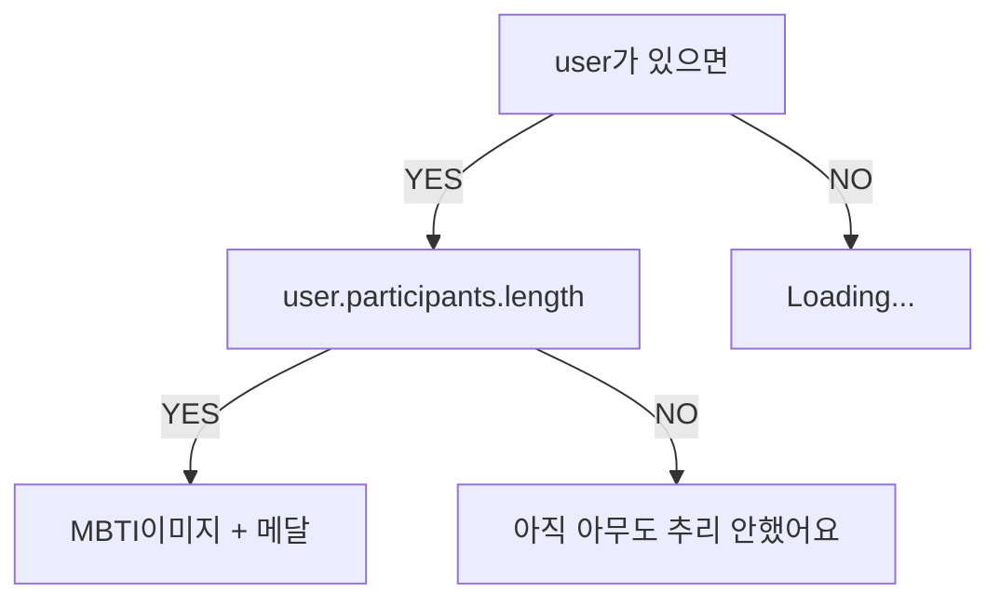

# BEFORE

```mermaid
flowchart TD
    A[user.participants.length] -->|YES| C;
    A -->|NO| B;
    B[아직 아무도 추리 안했어요];
    C[MBTI이미지 + 메달];
```

# AFTER

```mermaid
flowchart TD
    A[user가 있으면] -->|YES| C;
    A -->|NO| B;
    B[Loading...];
    C[user.participants.length] --> |YES| D;
    C --> |NO| E;
    D[MBTI이미지 + 메달];
    E[아직 아무도 추리 안했어요];
```
